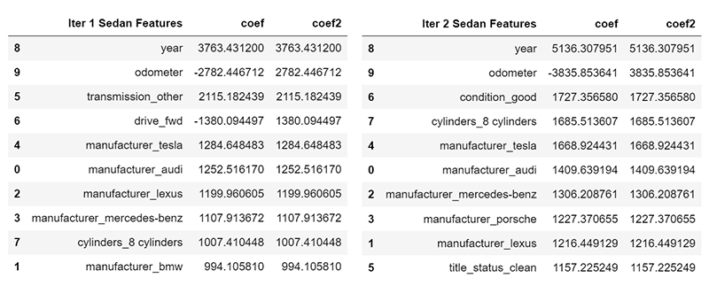
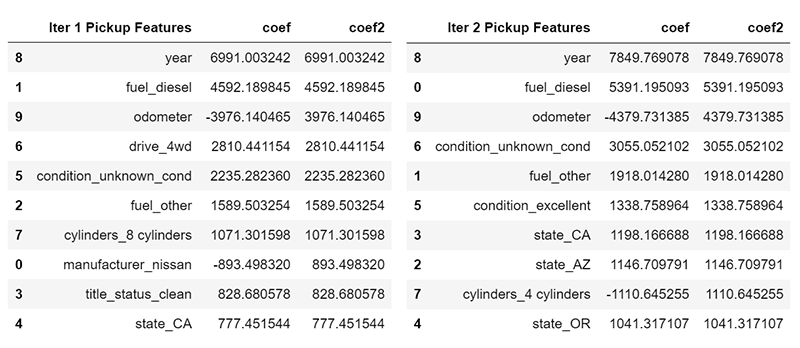

# What Drives the Price of a Car?

The original dataset contained information on 3 million used cars. The practice dataset contains information on 426K cars to ensure speed of processing. The objective of this project is to determine what factors make a car more or less expensive. After detailed analysis, a clear recommendation is provided to the client -- a used car dealership -- on what consumers value in a used car.

## Business Understanding

A car dealership aims to buy cars for less than they can sell them for, making the prediction of the final sale price critical. Aside from profit, demand is key for faster inventory turnover. Demand depends on many factors, but primarily on the drivers' demographics and preferences.

## Jupyter Notebooks

The first [Jupyter Notebook](data/AIML_practical2.ipynb) provides the initial cycle following the CRISP-DM Process Model. After initial findings, the process was repeated for further refinement. Additional notebooks are available for specific vehicle types:

- [SUV Notebook](data/iteration_suv.ipynb)
- [Sedan Notebook](data/iteration_sedan.ipynb)
- [Pickup Notebook](data/iteration_pickup.ipynb)

## Exploratory Data Analysis and Data Cleaning

The dataset contains **426,880 records** and **18 features**. It has many missing values and some rows with irrelevant advertisements. The "model" column includes ads like:

- SPECIAL FINANCE PROGRAM 2020
- Flexible Down Payments
- BUY HERE PAY HERE

These rows often have empty "manufacturer" values and are removed during data cleaning. Columns like "VIN" and "id" are dropped as they are just identifiers. The "region" column is also dropped since "state" is already included.

### Missing Values Summary

| Column        | Missing Values (%) |
|---------------|--------------------|
| size          | 71.77%             |
| cylinders     | 41.62%             |
| condition     | 40.79%             |
| VIN           | 37.73%             |
| drive         | 30.59%             |
| paint_color   | 30.50%             |
| type          | 21.75%             |
| manufacturer  | 4.13%              |
| title_status  | 1.93%              |
| model         | 1.24%              |
| odometer      | 1.03%              |
| fuel          | 0.71%              |
| transmission  | 0.60%              |
| year          | 0.28%              |

After cleaning, the dataset was reduced to **375,619 rows** and **14 features**.

### Outlier Removal

The "price" column was highly skewed, with extreme outliers. Prices above $150K were dropped. Similar methods were applied to "year" and "odometer" columns.

### Correlations

The numerical columns show high correlations:

- Price and year: 0.57
- Price and odometer: -0.53
- Odometer and year: -0.67

## Building ML Models

The data was transformed, normalized, and scaled using a pipeline. Categorical data was encoded using OneHotEncoder, normalized with QuantileTransformer, and scaled using StandardScaler.

The baseline linear model had an RMSE of **11,590** on the training data. Lasso, Ridge, and Linear Regression models showed better performance, all scoring close to **8,676**.

## Grid Search CV

A GridSearchCV with Lasso feature selection revealed 10 important features:

- Year
- Odometer
- Clean title
- Powerful engine (8 cylinders)
- Popular brands like Toyota and Tesla

Further analysis showed the need to segment data by vehicle type: SUVs, Sedans, and Pickups.

## SUVs

The analysis of SUVs revealed preferences for:

- Newer model year
- Lower odometer
- Clean title
- Popular brands: Toyota, Rover, Tesla

## Sedans

Sedans showed better performance with RMSE errors of **5,878** for training data. Key features included:

- Good condition
- Higher cylinder count
- Luxury brands: Audi, Mercedes-Benz, Porsche

## Pickups

Pickup trucks had distinct preferences, focusing on:

- Diesel fuel
- 4WD drivetrain
- Clean title
- Avoiding brands like Nissan

Sales were stronger in states like California, Arizona, and Oregon.

## Deployment

The general factors affecting car price are:

- Newer model year
- Lower odometer
- Clean title status

Segment-specific recommendations:

- **SUVs**: Focus on popular brands (Toyota, Rover, Tesla) and avoid 4-cylinder SUVs.
- **Sedans**: Target good condition, luxury brands, and higher cylinder count.
- **Pickups**: Prioritize 4WD, diesel engines, and avoid 4-cylinder models.

These recommendations are based on the provided dataset and should consider changing market trends and government incentives.

